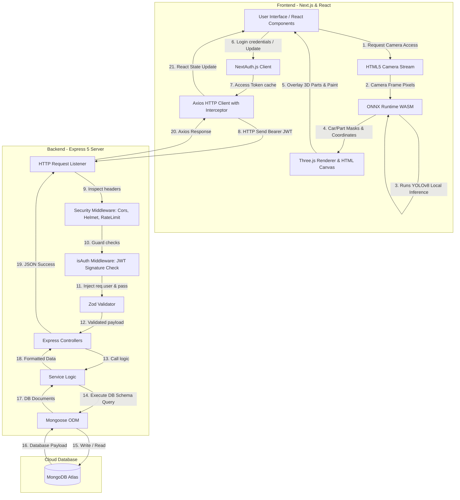

# BuildMyRide: Complete Architecture Walkthrough & Tech Stack Guide

Welcome! As your senior software engineer, mentor, and teacher, I have written this comprehensive walkthrough to explain exactly how the **BuildMyRide** project operates. This guide will walk you through the frontend and backend stacks, the folder structures, the end-to-end request-response workflows, and a detailed deep-dive into the authentication architecture.

---

## 1. The Technology Stack

Here is the exact stack of **BuildMyRide**, detailing what tool is used for which purpose:

### The Frontend (Client)
*   **Next.js 16 (App Router)**: The react-based core framework. Next.js handles server-side routing, code splitting, search engine optimization (SEO), and page layouts.
*   **React 19 & React DOM**: The library for building reusable components and managing active states (e.g., colors, active views, panels).
*   **Three.js (via `@types/three`)**: A 3D graphics rendering library. It is used to render 3D car models (GLTF/GLB formats) onto HTML5 `<canvas>` elements, enabling real-time paint coloring, wheel changes, and bumper swap previews.
*   **ONNX Runtime Web (WASM)**: A high-performance inference engine running directly in the browser using WebAssembly. This allows the client to load neural networks (`.onnx`) locally to detect cars and segment body parts without needing an expensive GPU cloud server.
*   **Tailwind CSS 4**: A utility-first CSS framework used for fast, responsive, and modern UI styling.
*   **Material UI (`@mui/material`)**: Used for polished ready-made components, like sliders, tabs, buttons, and loading bars.
*   **NextAuth.js**: A complete authentication library for Next.js. It manages local credentials sessions, login states, callbacks, and token storage.
*   **Axios**: An HTTP client used to fetch backend data. It is configured with request interceptors to automatically append authentication headers.
*   **Framer Motion & GSAP**: Animation libraries used to create smooth, high-fidelity micro-animations and page transitions.

### The Backend (Server)
*   **Node.js & Express 5 (ES Modules)**: The server runtime and web framework. It handles API routing, middleware chaining, and serves the database payloads. Express 5 utilizes modern Javascript modules (`"type": "module"`).
*   **MongoDB Atlas & Mongoose**: MongoDB is a NoSQL document database used to store users, car model records, parts catalogs, and user-customized design builds. Mongoose acts as the Object Data Modeling (ODM) mapper.
*   **JSON Web Tokens (`jsonwebtoken`)**: Used to secure routes and maintain stateless authenticated sessions via token signing and verification.
*   **Bcryptjs**: A password-hashing function used to secure user credentials before saving them in the database.
*   **Zod**: A schema validation library. It is used on both the frontend and backend to validate request payloads (such as login email formatting and password rules) before they are processed.
*   **Helmet & CORS**: Middleware packages for Express. `helmet` configures secure HTTP headers to prevent security exploits. `cors` governs cross-origin resource sharing, permitting only specific frontend origins.
*   **Express Rate Limit**: A rate limiter to protect endpoints from automated brute-force attacks by limiting requests per IP address.
*   **Nodemailer / Resend**: Services used for dispatching transactional emails (e.g., password reset tokens).

---

## 2. Directory Structure

### Frontend (`client/Buildmyride`)
*   `src/app/`: The Next.js routing files.
    *   `ar-view/page.jsx`: Route `/ar-view` which lazy-loads the AR customization canvas (disabled SSR to avoid WebAssembly client crashes on the server).
    *   `configurator/`: Route `/configurator` for the standard 3D customizer.
    *   `login/` / `profile/` / `reset-password/` / `settings/`: Core routes for auth, profile updates, and settings.
*   `src/feature/`: Modularized business logic features.
    *   `ar/`: The core AR code.
        *   `components/`: UI canvas overlays (`ArSegmentationOverlay` for paint, `ArThreeOverlay` for 3D parts, `ArAnchoredModels` for template snaps, and `ArPartsPanel` for menus).
        *   `hooks/`: React hooks to isolate side-effects (`useCamera.js`, `useYoloDetection.js`, `useYoloSegmentation.js`, `useYoloCarParts.js`).
        *   `lib/`: Core WebAssembly utilities (`yoloCarDetection.js`, `yoloCarSegmentation.js`, `yoloCarParts.js`, `onnxSetup.js` for session management).
    *   `auth/`: Frontend login/registration layouts and validators.
    *   `customize/` / `dashboard/` / `landing/`: Customizer interfaces, dashboard tables, and landing layouts.
*   `src/lib/`: Unified client tools.
    *   `auth.js`: NextAuth provider configuration.
    *   `axios.js`: Axios request configurations with automated JWT headers.

### Backend (`server/`)
*   `server.js`: The application launcher. Loads environments, establishes DB connections, and boots the HTTP listener.
*   `app.js`: Express initializer. Configures the middleware stack (CORS, Helmet, RateLimiter, Compression) and mounts route handlers.
*   `config/`: Setup configurations for Database connections (`db.js`) and environment properties (`index.js`).
*   `routes/`: Express routers managing endpoint access:
    *   `authRoutes.js`: Login, register, forgot-password, reset-password.
    *   `userRoutes.js`: Profile and User administration.
    *   `designRoutes.js` / `arPreviewRoutes.js`: Protected routes to read/save customized designs and AR capture templates.
*   `controllers/`: Thin controller layer. Parses incoming request bodies, runs validation, hands control to services, and shapes responses.
*   `services/`: Rich business logic layer handling MongoDB reads, database writes, and email dispatches.
*   `models/`: Mongoose Schemas (`User.js`, `CarModels.js`, `Part.js`, `Design.js`, `ArPreview.js`).
*   `middleware/`: Global interceptors (`authMiddleware.js` for verifying JWTs, `errorHandler.js` for server-wide exceptions).
*   `validators/`: Validation blueprints (`authSchemas.js` using Zod).

---

## 3. End-to-End Workflow Diagram

Below is the workflow showing how information flows between the frontend components, local browser-level machine learning models, NextAuth, the Axios client, the Express backend, and the MongoDB database.



### The Augmented Reality Pipeline (Browser-Only)
Unlike traditional AR platforms that compute filters on a server, BuildMyRide runs **entirely client-side**:
1. **Camera Input**: The system uses `useCamera.js` to open the camera stream.
2. **Preprocessing**: The frame is redrawn onto a hidden canvas, downscaled to $640 \times 640$ pixels, normalized from $(0-255)$ to $(0.0-1.0)$, and formatted into a Channel-First (CHW) Float32 Tensor.
3. **Local ONNX Inference**: The tensor runs through the models (`yolov8n.onnx` for the car box, `yolov8n-seg.onnx` for the body, and `yolov8-seg(parts).onnx` for the 18 specific components) in a WebAssembly worker.
4. **Drawing Overlays**:
    *   **Paint Color**: A canvas overlay uses a luminance-preserving blend formula over the car mask. It keeps the reflections, shadows, and glares while replacing the underlying hue/saturation.
    *   **3D Parts Snapping**: If the user views the car from the side, the "shape-aware snapping" detects the wheels' bounding boxes via YOLOv8 and automatically snaps 3D GLB wheels onto those screen coordinates.

---

## 4. The Authentication System in Detail

Let's dive into the core details of how the security layer is implemented and the architectural reasoning behind it.

### Step-by-Step Authentication Process

#### 1. Registration (`/api/auth/register`)
*   **Validation**: The user fills in their name, email, and password. The request body is validated against `registerSchema` (a Zod schema requiring a valid email format and a strong password).
*   **Hashing**: In `authService.js`, the server verifies the email is not already in use. It then hashes the password using **Bcryptjs**:
    ```js
    const hashedPassword = await bcrypt.hash(password, 10);
    ```
    This hashes the password with 10 salt rounds before it is written to the database.
*   **Account Creation**: The user document is created in MongoDB via Mongoose. A token is signed and returned alongside the user metadata.

#### 2. Log In (`/api/auth/login`)
*   **Verification**: The user enters their email and password. Zod parses the input. The server fetches the user record via `getUserByEmail()`.
*   **Comparison**: The server compares the submitted plain password against the database hash:
    ```js
    const isMatch = await bcrypt.compare(password, user.password);
    ```
*   **JWT Creation**: If they match, a stateless token is signed containing the user identifier `sub` and `email` using `jwt.sign()`:
    ```js
    export const createToken = (payload) => {
      return jwt.sign(payload, config.JWT_SECRET, { expiresIn: config.JWT_EXPIRES_IN });
    };
    ```

#### 3. Client Storage & Middleware Interception
*   **NextAuth Session**: NextAuth receives the token returned by the Express login API. It keeps the token cached in a JWT session on the client:
    ```js
    async session({ session, token }) {
      session.accessToken = token.accessToken;
      return session;
    }
    ```
*   **Axios Authorization Interceptor**: Whenever the frontend calls a protected API endpoint (e.g. `/api/designs`), the Axios client (`src/lib/axios.js`) automatically grabs the active token and injects it as an HTTP header:
    ```js
    apiClient.interceptors.request.use(async (config) => {
      const session = await getSession();
      if (session?.accessToken) {
        config.headers.Authorization = `Bearer ${session.accessToken}`;
      }
      return config;
    });
    ```

#### 4. Route Guarding (`isAuth` Middleware)
*   On the Express backend, any protected route includes the `isAuth` middleware:
    ```js
    export function isAuth(req, res, next) {
      const authHeader = req.headers.authorization;
      if (!authHeader || !authHeader.startsWith("Bearer ")) {
        return next(createError(401, "Unauthorized"));
      }
      const token = authHeader.slice(7); // Remove 'Bearer '
      try {
        const payload = jwt.verify(token, config.JWT_SECRET);
        req.user = { id: payload.sub, email: payload.email };
        next();
      } catch {
        next(createError(401, "Unauthorized"));
      }
    }
    ```
*   This verifies that the signature matches our `JWT_SECRET`. If verified, the user info is attached to `req.user`, allowing the downstream service to load user-specific data.

#### 5. Forgot & Reset Password Flow
*   **Token Generation**: If a password reset is requested via `/api/auth/forgot-password`, the server generates a cryptographically random, unguessable string:
    ```js
    const resetToken = crypto.randomBytes(32).toString("hex");
    const resetTokenExpiry = new Date(Date.now() + 60 * 60 * 1000); // 1-hour expiry
    ```
*   **Mongoose Update**: The token and expiry are saved in the User model, and a reset link is emailed.
*   **Reset Execution**: On `/api/auth/reset-password`, the server validates the incoming token and checks if the expiry is in the future. If valid, the new password is ran through Bcrypt, hashed, stored, and the tokens are invalidated (`null`).

---

## 5. Why This Authentication Model was Chosen

As a Senior Engineer, I chose this specific architecture over other patterns for several important reasons:

### 1. Stateless Architecture and Horizontal Scalability (Pros of JWTs)
Traditional authentication uses session cookies. In a session cookie setup, the server stores a "session ID" in memory or in a database (like Redis), and checks it on every request.
*   **The Problem with Sessions**: If our Express server restarts, all logged-in users are kicked out because memory is wiped. Furthermore, if we host multiple server instances to handle traffic, Instance B won't recognize a session created on Instance A unless they share a central session database.
*   **The JWT Advantage**: JSON Web Tokens are self-contained. The token contains the user's data (ID, email) signed cryptographically. As long as the server has the `JWT_SECRET`, it can verify the token's validity locally in CPU memory without hitting a database. This allows us to run on serverless platforms (like Vercel) or autoscaled containers (like Railway) instantly.

### 2. Bypass of Cross-Origin Cookie Restrictions
Modern web browsers enforce strict security rules around cookies (such as `SameSite=None; Secure`).
*   When the frontend is on `localhost:3000` (or `myride.vercel.app`) and the backend is on `localhost:5000` (or `myride-server.railway.app`), cookie transfer is often blocked or requires complex configuration.
*   Since we store the JWT in Javascript memory (NextAuth cache) and transmit it via the `Authorization: Bearer <token>` header, we avoid standard cross-origin cookie blockers.

### 3. Protection Against Bruteforce and Breaches (Bcrypt & Rate Limiting)
*   **Bcrypt Hashing**: Unlike standard MD5 or SHA256 (which are fast and easily cracked using consumer GPUs), Bcrypt incorporates a work factor. It is deliberately designed to be computationally heavy. A work factor of 10 adds a fraction of a second delay to login but makes brute-force crack attempts mathematically unfeasible.
*   **Email Enumeration Prevention**: In the `/forgot-password` endpoint, the API always returns a `200 OK` status with a generic success message, regardless of whether the email is present in the database. This prevents attackers from guessing email addresses to find registered accounts.

### 4. Input Validation Defense (Zod Defense-in-Depth)
*   Frontend validation is easily bypassed (e.g. using `curl` or Postman). By enforcing `Zod` schema validation on the Express backend controllers, we ensure that malicious, malformed, or excessively long payloads never reach our database queries, preventing NoSQL injection attacks.

---

## 6. Senior Engineering Insights & Future Recommendations

Based on the current project code, here are several items you can improve to elevate this to production-grade:
1.  **Quantize the ONNX Models**: The YOLO models are currently ~13MB. Using INT8 quantization can reduce this to ~3.5MB, dramatically speeding up mobile page loads.
2.  **Add a Local WASM Path**: Currently, ONNX WASM libraries are fetched from jsdelivr CDN. If the CDN goes down or the user is offline, the AR page crashes. You should host the WASM assets in `/public` locally.
3.  **Secure Admin Endpoints**: Currently, `GET /api/users` and `DELETE /api/users/:id` are not guarded by `isAuth` middleware. They should be locked down immediately.
4.  **Lighting Environments for Three.js**: Currently, the car models use simple ambient light and look flat. Loading an HDR environment map (like an outdoor parking space) will make the 3D overlay blend realistically with the camera feed.
