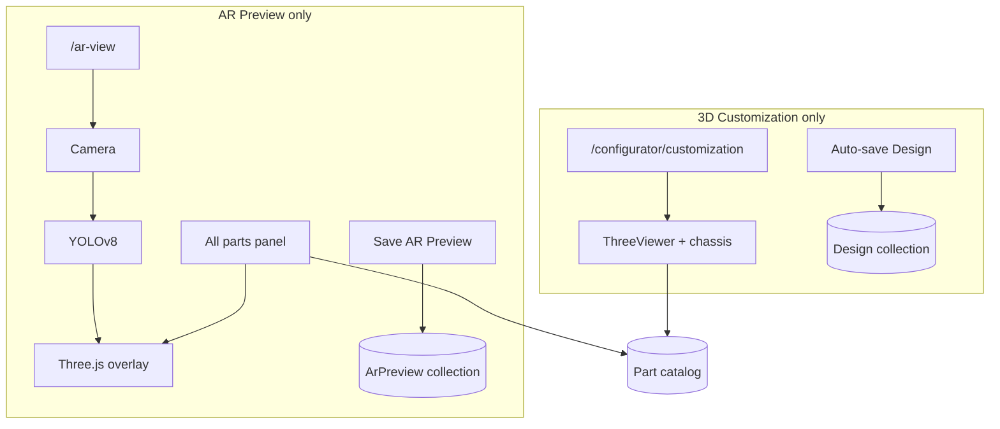
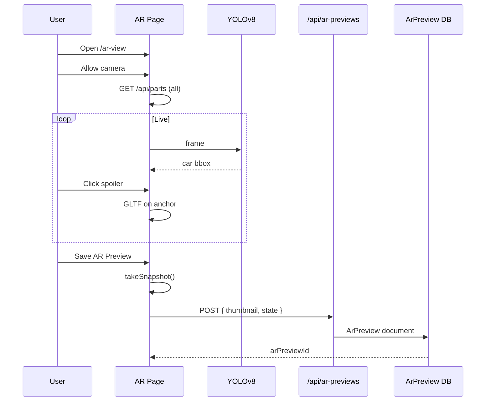

# BuildMyRide — AR Preview Implementation Walkthrough

Complete guide for the **AR Preview** feature. This document is **only** about AR Preview.

**Do not treat AR Preview and 3D Customization as the same feature.** They share the same parts catalog in MongoDB and the same login, but they have different pages, different UX, different save records, and different runtime behavior.

---

**Repo:** `Buildmyride/client` (Next.js) + `Buildmyride/server` (Express)  
**AR route (to create):** `/ar-view`  
**3D studio route (existing):** `/configurator/customization`  
**UI links to AR:** Dashboard, Sidebar, Landing, DesignCard → `/ar-view`

---

## Table of contents

1. [Two separate features](#1-two-separate-features)
2. [What AR Preview is](#2-what-ar-preview-is)
3. [Your intended user flow](#3-your-intended-user-flow)
4. [YOLOv8 vs COCO-SSD](#4-yolov8-vs-coco-ssd)
5. [Parts panel — all parts, no carId filter](#5-parts-panel--all-parts-no-carid-filter)
6. [What is designId (AR context only)](#6-what-is-designid-ar-context-only)
7. [Saving AR Preview — exactly what gets stored](#7-saving-ar-preview--exactly-what-gets-stored)
8. [AR save strategy and API design](#8-ar-save-strategy-and-api-design)
9. [Architecture](#9-architecture)
10. [Folder structure](#10-folder-structure)
11. [Phase 1 — Camera and AR page UI](#11-phase-1--camera-and-ar-page-ui)
12. [Phase 2 — YOLOv8 car detection](#12-phase-2--yolov8-car-detection)
13. [Phase 3 — Three.js overlay and part apply](#13-phase-3--threejs-overlay-and-part-apply)
14. [Phase 4 — Cross-platform and fallback](#14-phase-4--cross-platform-and-fallback)
15. [Attaching parts to the real car in camera](#15-attaching-parts-to-the-real-car-in-camera)
16. [End-to-end session](#16-end-to-end-session)
17. [Sprint checklist](#17-sprint-checklist)
18. [Dependencies](#18-dependencies)
19. [Pitfalls](#19-pitfalls)
20. [FYP report bullets](#20-fyp-report-bullets)

---

## 1. Two separate features

| | **3D Customization** | **AR Preview** |
|---|----------------------|----------------|
| **Purpose** | Build a car on a **virtual 3D chassis** in the garage | Try parts on a **real car** seen through the **camera** |
| **Route** | `/configurator/customization` | `/ar-view` |
| **Main view** | `ThreeViewer` + chassis GLTF | Live `<video>` + transparent Three.js overlay |
| **Part placement** | Anchors inside chassis model (`pos_Front_Bumper`, etc.) | **YOLOv8** bounding box (later: mask/keypoints) on live video |
| **Parts list** | Filtered by selected chassis `carId` | **All parts** from DB (`GET /api/parts` with no filter) |
| **Save record** | `Design` collection (studio drafts) | **`ArPreview`** collection (recommended) — separate from studio |
| **Save id** | `designId` = MongoDB `_id` of a **Design** | `arPreviewId` = MongoDB `_id` of an **ArPreview** |
| **Thumbnail** | Screenshot of 3D viewer | Snapshot of **camera + AR overlay** at save time |
| **Resume** | Open studio with `?designId=` | Open AR with `?arPreviewId=` and re-apply parts when YOLO detects a car |

**Shared infrastructure (only):**

- User authentication (NextAuth + JWT)
- `Part` catalog in MongoDB (`modelUrl`, `category`, etc.)
- GLTF loading patterns (loader, scale) — copy ideas, not the same component tree

**Not shared:**

- Page layout, state hooks, auto-save triggers, `carId` requirement, chassis loading, or mixing studio `designId` into AR unless you explicitly add “import studio design” later as an optional extra.

---

## 2. What AR Preview is

AR Preview is a **standalone feature**:

1. User opens **`/ar-view`**.
2. **Camera** starts (rear on mobile, webcam on desktop).
3. **Right panel** lists **all parts** from the database, grouped by category (Spoiler, Wheels, Bumper, …) — same *interaction pattern* as a sidebar picker, but **not** the 3D customization page.
4. **YOLOv8** finds the car in each video frame and returns a 2D box (and optionally a mask in V2).
5. User clicks e.g. **Spoiler** → chooses a part → that GLTF is drawn on the **real car** in the video.
6. User clicks **Save AR Preview** → see [Section 7](#7-saving-ar-preview--exactly-what-gets-stored).

This is **video-overlay AR** (2D tracking from vision). It is not full WebXR room AR unless you add that later.

---

## 3. Your intended user flow

```text
┌──────────────────────────────────────────────────────────────────┐
│  AR Preview                                          [Save] [X]  │
├───────────────────────────────┬──────────────────────────────────┤
│                               │  VEHICLE PARTS (from DB)         │
│   Live camera                 │  ┌─ BODY PAINT ─────────────┐    │
│   + YOLOv8 box (debug opt.)   │  ├─ SPOILERS ───────────────┤    │
│   + Three.js parts on car     │  │  [thumb] [thumb] [thumb] │    │
│                               │  ├─ WHEELS ────────────────┤    │
│                               │  ├─ BUMPERS ───────────────┤    │
│                               │  └─ ... all categories ────┘    │
└───────────────────────────────┴──────────────────────────────────┘

Steps:
  1. Open /ar-view
  2. Allow camera → video fills left (main) area
  3. Right panel loads GET /api/parts (no carId) → show ALL parts
  4. YOLOv8 runs on video → car anchor updates every frame
  5. User expands Spoilers → clicks one part
       → arBuild["Spoilers"] = part.modelUrl
       → GLTF loads onto car anchor in overlay
  6. User adds more parts (wheels, bumper, …) same way
  7. User clicks Save AR Preview → persist ArPreview (see Section 7)
```

**Important:** Clicking a part in the right panel only updates **AR session state** until the user saves. Saving is a deliberate action (recommended first); optional debounced auto-save can come later.

---

## 4. YOLOv8 vs COCO-SSD

This project uses **YOLOv8 only** (not COCO-SSD).

### What each is

Both are **object detectors**: they input an image/frame and output where objects are (class + box + confidence).

| | **COCO-SSD** | **YOLOv8** |
|---|--------------|------------|
| Provider | TensorFlow.js prebuilt `@tensorflow-models/coco-ssd` | Ultralytics YOLO, exported for web |
| Setup in browser | Very easy (few lines) | Harder: export `.pt` → TF.js or ONNX → `onnxruntime-web` |
| Speed | Good | Excellent (especially `yolov8n`) |
| Accuracy on cars | Adequate | Usually **better** at angles, distance, partial cars |
| Bounding box | Yes | Yes |
| Segmentation mask | No | Yes (`yolov8n-seg`) — outline of car |
| Custom keypoints | No | Possible with custom pose model (V2) |

### Why YOLOv8 for BuildMyRide AR

- Better detection on **real** cars in phone camera footage.
- Path to **segmentation** (cleaner overlay, occlusion later).
- Industry-standard for FYP demos and reports.

### What YOLOv8 does *not* do

- It does **not** load spoilers/rims from your DB.
- It only answers: **“Where is the car in this frame?”**

Parts come from **`GET /api/parts`** and user clicks on the right panel.

### Browser integration outline

```text
1. Obtain model: yolov8n.pt (COCO-trained includes class "car" = id 2)
2. Export for web:
   - Option A: TensorFlow.js format
   - Option B: ONNX + onnxruntime-web (common)
3. Each frame (or every 2nd frame on mobile):
   - Draw video to canvas / tensor
   - Run inference
   - Filter detections: class === car, confidence > threshold
   - Pick largest car box
   - Smooth box (lerp) → pass to Three.js anchor
```

---

## 5. Parts panel — all parts, no carId filter

### API call

```http
GET /api/parts
```

No query parameters. Your server already returns **all** parts when `carId` is omitted (`partController.js`).

### UI

Reuse the **interaction pattern** from the studio sidebar (accordion categories, thumbnails, click to apply), but implement it under `feature/ar/` — **not** by importing `CustomizePage` or sharing its React state.

Suggested grouping:

```javascript
const res = await apiClient.get("/parts");
const parts = res.data;

// Group by part.category → Spoilers, Wheels, Hood, Bumper, ...
const grouped = {};
parts.forEach((part) => {
  const key = part.category.toLowerCase();
  if (!grouped[key]) grouped[key] = [];
  grouped[key].push(part);
});
```

### Compatibility note

Parts may have `compatibleCars[]` in MongoDB for studio filtering. In AR you still **show all parts**. Optional UI:

- Show small text: “Compatible with: Civic, …”
- Or warning when applying: “May not fit all vehicles”

Placement on the real car is driven by **YOLO box**, not by `compatibleCars`.

---

## 6. What is designId (AR context only)

### Studio `designId` (3D Customization only)

- MongoDB `_id` of a **`Design`** document.
- Created/updated by the **3D studio** (`POST/PUT /api/designs`).
- Used to resume the **virtual garage** build.
- **Not required for AR Preview** and **not the same** as `arPreviewId`.

### AR `arPreviewId` (AR Preview only)

- MongoDB `_id` of an **`ArPreview`** document (recommended separate collection).
- Created when user clicks **Save AR Preview** in `/ar-view`.
- Used to reload **which parts were applied in AR** next time (`?arPreviewId=...`).
- Optional in URL; opening `/ar-view` without it starts a **new** AR session.

```text
Studio:  /configurator/customization?designId=abc     → Design document
AR:      /ar-view?arPreviewId=xyz                   → ArPreview document
```

Do not use `designId` in AR routes unless you later add an explicit optional feature: “Import studio design into AR” (out of scope for this walkthrough).

---

## 7. Saving AR Preview — exactly what gets stored

When the user clicks **Save AR Preview** after applying e.g. a spoiler, **two different things** are saved. Be explicit in demos and reports.

### A. Snapshot (thumbnail) — a 2D image only

| Question | Answer |
|----------|--------|
| **What is it?** | A **PNG/JPEG screenshot** taken at the moment of save. |
| **What does it show?** | What was on screen: **camera frame + overlaid 3D parts** (spoiler, rims, etc.) composited into one image. |
| **What is it for?** | Gallery card, dashboard listing, FYP report figures — visual proof of the session. |
| **What is it NOT?** | Not a 3D file, not a video, not a magic replay of the real car later. |
| **Stored where?** | `ArPreview.thumbnail` — typically **base64 data URL** or upload to cloud and store URL (your choice). |

**Implementation:** At save time, capture from the AR viewport:

- Preferred: composite **video frame + Three.js canvas** into one image.
- Minimum: screenshot of the **Three.js canvas** only (less impressive but simpler).

```javascript
const thumbnail = arViewportRef.current.takeSnapshot(); // returns data:image/png;base64,...
```

### B. AR build state — data to re-apply parts later

| Question | Answer |
|----------|--------|
| **What is it?** | JSON describing **which parts the user selected** in AR. |
| **What does it include?** | Category/slot → `modelUrl` (and optionally `partId`), wheel URLs per corner, paint color if used. |
| **What is it NOT?** | Not the live camera recording, not YOLO coordinates, not the real car’s license plate or location. |
| **Stored where?** | `ArPreview.state` (or `arState`) field. |
| **Used when?** | User opens `/ar-view?arPreviewId=...` → app loads state → when YOLO detects **any** car again, GLTFs are loaded and attached to the **new** detection box. |

Example `ArPreview.state`:

```javascript
{
  paint: { color: "#1e3a5f", finish: "glossy" },
  appliedParts: {
    "Spoilers": { partId: "...", modelUrl: "https://.../spoiler.glb" },
    "Front_Bumper": { partId: "...", modelUrl: "https://.../bumper.glb" }
  },
  wheels: {
    "front-left": "https://.../rim.glb",
    "front-right": "https://.../rim.glb",
    "rear-left": "https://.../rim.glb",
    "rear-right": "https://.../rim.glb"
  }
}
```

### What happens after save — user-visible behavior

```text
SAVE clicked
  │
  ├─► Snapshot captured NOW
  │     → frozen picture of car + spoiler on screen at that second
  │     → shown on dashboard as preview card image
  │
  └─► arState saved to database
        → list of parts (spoiler URL, etc.)
        → does NOT embed the real car
        → next AR session: user points camera at a car again
        → YOLO finds car → app re-loads same spoiler GLTF onto new detection
```

### Clear answers for viva / report

| Misconception | Truth |
|---------------|--------|
| “Save stores the modified real car” | **No.** It stores a **photo** (thumbnail) + **part list** (state). |
| “I can open the save and see the same parking lot car” | **No.** Only the **image** shows that moment. Live AR reloads parts on whatever car the camera sees. |
| “Save stores the video” | **No**, unless you add optional video export later. |
| “Snapshot updates when I change spoiler before saving” | Only the **next** save captures a new snapshot. |

### Recommended save button copy

- **Save AR Preview** — saves snapshot + part state.  
- Status: `Saving…` → `Saved` / `Save failed`.  
- After first save: show “Saved as AR Preview #xyz” and set `arPreviewId` in state/URL.

---

## 8. AR save strategy and API design

Keep AR saves **separate** from studio `Design` saves.

### New MongoDB model (recommended): `ArPreview`

```javascript
// server/models/ArPreview.js (to create)
{
  userId: ObjectId,          // required, same as Design
  name: String,              // e.g. "AR Build 20 May 2026"
  thumbnail: String,         // base64 or CDN URL — THE SNAPSHOT
  state: {
    paint: { color, finish },
    appliedParts: { slotOrCategory: { partId, modelUrl } },
    wheels: { "front-left": url, ... }
  },
  createdAt, updatedAt
}
```

### API routes (recommended)

| Method | Route | Purpose |
|--------|-------|---------|
| `POST` | `/api/ar-previews` | First save → returns `arPreviewId` |
| `PUT` | `/api/ar-previews/:id` | Update parts + new snapshot |
| `GET` | `/api/ar-previews` | List current user’s AR saves (dashboard “AR gallery”) |
| `GET` | `/api/ar-previews/:id` | Load one for resume in `/ar-view` |
| `DELETE` | `/api/ar-previews/:id` | Optional |

All routes: `isAuth` middleware (same JWT as today).

### When to call save

| Trigger | Recommendation |
|---------|----------------|
| Manual **Save AR Preview** button | **Yes — implement first** |
| Debounced auto-save (2s after part change) | Optional later |
| Auto-save every YOLO frame | **Never** |
| Auto-save on part click without debounce | Avoid (too many API calls) |

### Local state before save

```javascript
// AR-only React state (not CustomizePage state)
const [arBuild, setArBuild] = useState({});      // category/slot → modelUrl
const [arWheels, setArWheels] = useState({ ... });
const [selectedColor, setSelectedColor] = useState("#1e3a5f");
const [arPreviewId, setArPreviewId] = useState(null);
```

On spoiler click:

```javascript
function handleArPartSelect(category, part) {
  setArBuild((prev) => ({ ...prev, [category]: part.modelUrl }));
  arOverlay.loadPart(category, part.modelUrl); // Three.js on detected car
  // No API call until Save
}
```

### `captureArPreview()` for API body

```javascript
function captureArPreview() {
  return {
    name: arName || `AR Preview ${new Date().toLocaleDateString()}`,
    thumbnail: arViewport.takeSnapshot(),
    state: {
      paint: { color: selectedColor, finish: "glossy" },
      appliedParts: arBuild,
      wheels: arWheels,
    },
  };
}
```

---

## 9. Architecture

```text
┌─────────────────────────────────────────────────────────────────┐
│                        ArPreviewPage                             │
│  (feature/ar — separate from feature/customize)                  │
├─────────────────────────────────────────────────────────────────┤
│  useCamera()              → getUserMedia → <video>               │
│  useYoloDetection()       → YOLOv8 → bbox (+ mask V2)            │
│  useArPartsCatalog()      → GET /api/parts (all)                 │
│  useArBuildState()        → arBuild, arWheels, paint              │
│  ArOverlayThree()         → GLTF on car anchor                   │
│  ArPartsPanel()           → right sidebar UI                     │
│  saveArPreview()          → POST/PUT /api/ar-previews            │
└─────────────────────────────────────────────────────────────────┘
          │                                    │
          ▼                                    ▼
   MediaStream + YOLO                    Part.modelUrl (DB)
```



---

## 10. Folder structure

```text
client/src/
  feature/ar/                          # AR ONLY — do not put in feature/customize
    ArPreviewPage.jsx
    hooks/
      useCamera.js
      useYoloDetection.js
      useArPartsCatalog.js
      useSmoothedBBox.js
      useArPreviewSave.js
    lib/
      arCoordinates.js
      loadArGltf.js
      captureArSnapshot.js
    components/
      ArViewport.jsx                   # video + three + snapshot
      ArPartsPanel.jsx                 # all parts, accordion
      ArControls.jsx                   # Save, Close, status
      ArStatusBar.jsx

  app/ar-view/page.jsx

server/
  models/ArPreview.js                  # NEW — separate from Design.js
  controllers/arPreviewController.js
  routes/arPreviewRoutes.js            # mount /api/ar-previews in app.js
```

**Do not:**

- Mount AR UI inside `CustomizePage.jsx`
- Reuse studio `designId` / `saveDraft()` for AR saves
- Require `carId` to list parts in AR

---

## 11. Phase 1 — Camera and AR page UI

### Route

`client/src/app/ar-view/page.jsx` → renders `ArPreviewPage`.

### Layout

- **Left (~70%):** camera + Three overlay.
- **Right (~320px):** `ArPartsPanel` with all parts.
- **Top bar:** Close, **Save AR Preview**, status text.

### Camera (`useCamera.js`)

```javascript
const constraints = {
  video: {
    facingMode: { ideal: isMobile ? "environment" : "user" },
    width: { ideal: 1280 },
    height: { ideal: 720 },
  },
  audio: false,
};
```

**iOS:** `<video autoPlay playsInline muted />`, start after user gesture.

### Phase 1 done when

- [ ] `/ar-view` loads
- [ ] Camera works on phone and desktop
- [ ] Right panel loads all parts from `GET /api/parts`
- [ ] No dependency on studio routes or `designId`

---

## 12. Phase 2 — YOLOv8 car detection

### Responsibilities

- Load model once at AR start.
- Run inference every N frames (10–15 FPS mobile, 20–30 desktop).
- Output: `{ x, y, width, height, confidence }` in video pixel space.
- Smooth with lerp (`useSmoothedBBox.js`).
- If confidence low for 2s → show “Point camera at full car / improve lighting”.

### Debug

Draw rectangle on a 2D canvas over video until Three overlay is ready.

### Phase 2 done when

- [ ] Car box tracks a real car in live video
- [ ] Performance acceptable on target phone

---

## 13. Phase 3 — Three.js overlay and part apply

### Overlay

- Transparent `WebGLRenderer` over video, same size, `alpha: true`.
- `carAnchor` group position/scale from smoothed YOLO bbox.
- `OrthographicCamera` matched to container aspect (MVP).

### On part click (right panel)

```text
User clicks spoiler in ArPartsPanel
  → update arBuild
  → GLTFLoader.load(part.modelUrl)
  → attach to carAnchor at spoiler offset (rear-top of bbox)
  → visible on live car in camera
```

### Offset tuning (MVP)

| Part | Anchor relative to car bbox |
|------|-------------------------------|
| Spoiler | Top center, rear 10% of box height |
| Wheels | Bottom corners (~25% width inset, bottom 20%) |
| Bumper / hood | Front/back edge centers (V2 refine with seg mask) |

### Phase 3 done when

- [ ] Click spoiler → appears on detected car
- [ ] Multiple part types work
- [ ] Snapshot function captures composited image

---

## 14. Phase 4 — Cross-platform and fallback

| Topic | Action |
|-------|--------|
| iOS Safari | `playsInline`, `muted`, user gesture for `play()` |
| Orientation | `resize` → remap bbox + renderer size |
| Thermal | Limit YOLO FPS; pause when tab hidden |
| No camera | Photo upload → single-frame YOLO → static overlay + save snapshot |
| No WebGL | Message + photo mode with 2D overlay only |

---

## 15. Attaching parts to the real car in camera

### MVP (YOLO bbox)

- One `carAnchor` per frame from bbox center and width.
- Parts are children with fixed local offsets.
- Scale anchor from bbox width vs reference width constant (tune manually).

### V2 (YOLOv8-seg or pose)

- Seg mask → occluder mesh.
- Wheel keypoints → rim placement and rotation.
- Kalman/lerp on anchor to reduce jitter.

---

## 16. End-to-end session

```text
1. User → /ar-view (no arPreviewId)
2. Start camera
3. GET /api/parts → fill right panel (all parts)
4. YOLOv8 tracks car
5. User: Spoilers → pick part → spoiler on live car
6. User: Wheels → pick rim → apply to 4 corners or one wheel mode
7. User: Save AR Preview
     a. takeSnapshot() → thumbnail image stored
     b. arBuild + wheels + paint → state stored
     c. POST /api/ar-previews → arPreviewId
8. Dashboard shows AR card with thumbnail image
9. User reopens /ar-view?arPreviewId=...
     → GET ar preview → reload GLTFs when car detected again
```



---

## 17. Sprint checklist

| # | Task | Feature |
|---|------|---------|
| 1 | `ArPreview` model + `/api/ar-previews` routes | AR only |
| 2 | `/ar-view` + `ArPreviewPage` layout | AR only |
| 3 | `useCamera` + video | AR |
| 4 | `GET /parts` all → `ArPartsPanel` | AR |
| 5 | YOLOv8 in browser + debug box | AR |
| 6 | Three overlay + `carAnchor` | AR |
| 7 | Click part → apply on car | AR |
| 8 | `takeSnapshot()` + Save button | AR |
| 9 | POST/PUT ar-previews + `arPreviewId` resume | AR |
| 10 | Dashboard AR gallery (optional) | AR |
| 11 | Do **not** wire AR save to `Design` / `designId` | Separation |

---

## 18. Dependencies

### Client (AR)

```bash
cd Buildmyride/client
# YOLOv8 web runtime — choose one approach:
npm install onnxruntime-web
# and/or TensorFlow.js export path for YOLOv8
npm install @tensorflow/tfjs
```

`three` is already installed.

### Server

No YOLO on server — inference runs **in the browser**.

### Environment

```env
NEXT_PUBLIC_API_URL=http://localhost:5000/api
```

AR uses `apiClient` for `/parts` and `/ar-previews`.

---

## 19. Pitfalls

| Pitfall | Fix |
|---------|-----|
| Mixing AR with `CustomizePage` | Separate `feature/ar` and `ArPreview` model |
| Using studio `designId` in AR | Use `arPreviewId` only |
| Thinking save stores “3D car model of real car” | Save = **snapshot image** + **part URLs** |
| Filtering parts by `carId` in AR | `GET /parts` with no query |
| Saving YOLO bbox to DB | Ephemeral only; re-detect on resume |
| COCO-SSD in new code | Use YOLOv8 per this doc |
| `Design.state.carId` required | ArPreview state has **no chassis** requirement |

---

## 20. FYP report bullets

- **Two features:** 3D Customization (virtual chassis) vs AR Preview (live camera + YOLOv8).
- **AR UX:** Full parts catalog in sidebar; click-to-apply on detected vehicle.
- **AI:** YOLOv8 in-browser for car localization; privacy (no video upload).
- **Persistence:** `ArPreview` with **thumbnail snapshot** (2D proof) and **state** (part list for reload).
- **Clarification:** Saving does not digitize the real car; it saves a photo + configuration.
- **Future:** Segmentation mask, keypoints, AR gallery on dashboard.

---

## Quick reference — studio vs AR files

| AR Preview (use / create) | 3D Customization (do not modify for AR) |
|---------------------------|----------------------------------------|
| `feature/ar/*` | `feature/customize/*` |
| `app/ar-view/page.jsx` | `app/configurator/customization/page.jsx` |
| `ArPreview.js` model | `Design.js` model |
| `/api/ar-previews` | `/api/designs` |
| `arPreviewId` | `designId` |

---

## Day 1 — start here

1. Create `ArPreview` schema + `POST /api/ar-previews` on server.
2. Create `/ar-view` + camera + right panel `GET /api/parts` (all).
3. Integrate YOLOv8 → debug bounding box.
4. Click one spoiler → show on car.
5. Implement `takeSnapshot()` + Save → verify thumbnail and state in MongoDB.

---

*Last updated: AR Preview as standalone feature — YOLOv8, all parts panel, separate ArPreview save with snapshot + state.*
